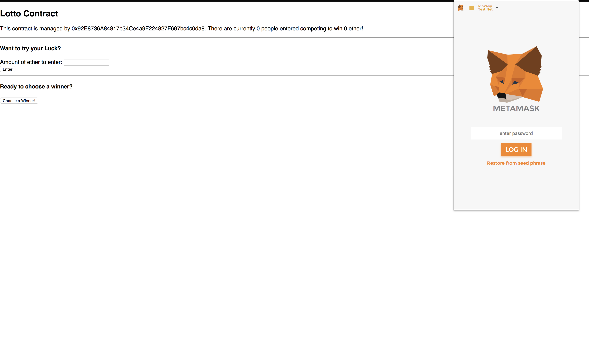
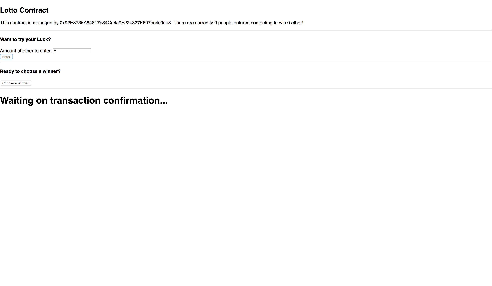
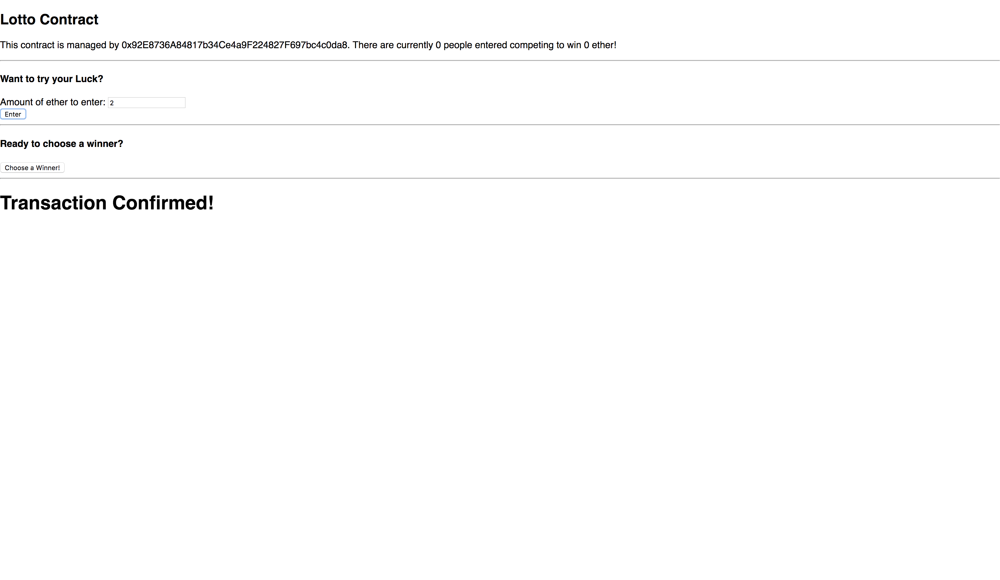

# Lotto React

Using the Lotto Smart Contract (in separate repository) this web application allows users to enter a lottery with Ether and chooses 'psuedo-random' winner.

## Inspiration

I wanted to gain more familiarity around smart contract scripting on the Ethereum Blockchain. This includes data structures, debugging with remix and function modifiers.

## Screenshots
Landing Page:

Transaction Confirming:

Transaction Confirmed:

## Summary & Technology Used

To use this application, be sure to have Metamask installed and logged in. 

The application uses the Lotto smart contract written in Solidity, Web3 to retrieve information and write information to and from the smart contract, React as the front end framework, mocha for contract test, truffle for account wallet and infura for node connection.
